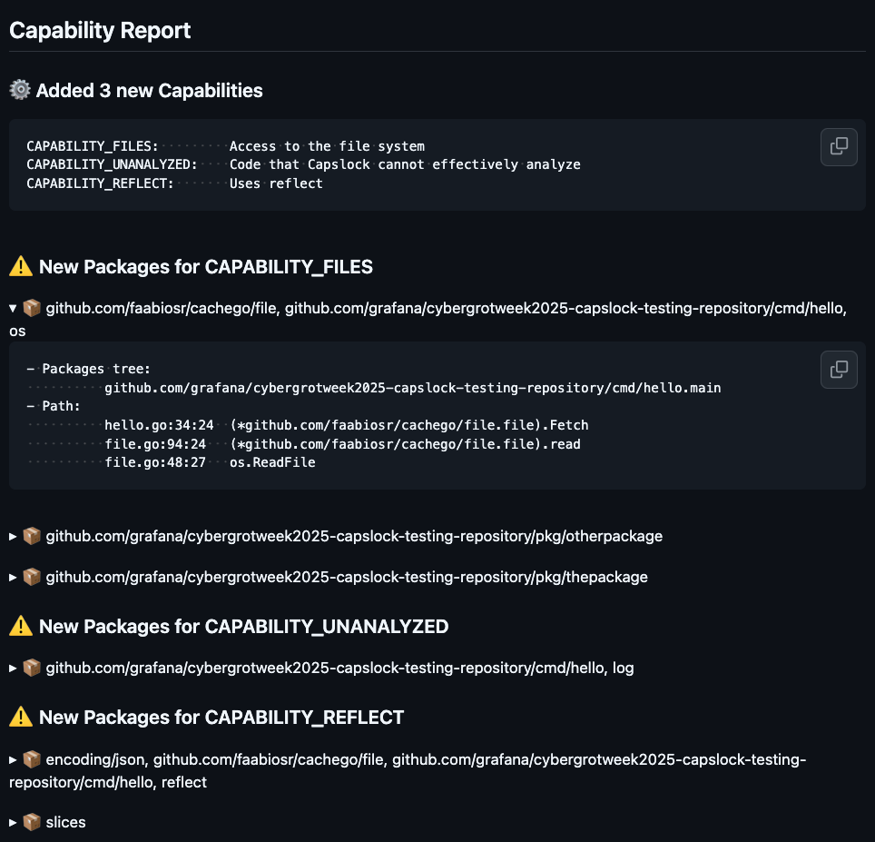

# run-capslock

Runs https://github.com/google/capslock action

<!-- x-release-please-start-version -->

```yaml
name: Send And Respond to a Slack message using JSON payload
jobs:
  run-capslock:
    name: Runs Capslock
    steps:
      - name: Run Capslock
        uses: grafana/shared-workflows/actions/run-capslock@run-capslock/v0.2.0
        id: run-capslock
```

<!-- x-release-please-end-version -->

## Inputs

| Name               | Description                                            | Default    |
| ------------------ | ------------------------------------------------------ | ---------- |
| `go-version`       | Go version to use                                      | 1.24.6     |
| `capslock-version` | Capslock version to use                                | v0.2.8     |
| `scope`            | Path to run                                            |            |
| `main-branch`      | Main branch name                                       | main       |
| `output-place`     | Output place (options: pr-comment\*, summary and log ) | pr-comment |

\* For pr-comment the permission pull-request: write it's needed

## PR Comment example


