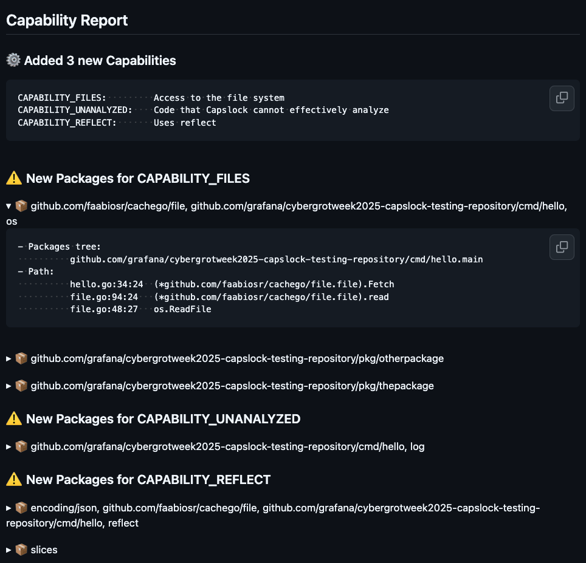

# run-capslock

Runs https://github.com/google/capslock action

<!-- x-release-please-start-version -->

```yaml
name: Send And Respond to a Slack message using JSON payload
jobs:
  run-capslock:
    name: Runs Capslock
    steps:
      - name: Run Capslock
        uses: grafana/shared-workflows/actions/run-capslock@run-capslock/v0.2.3
        id: run-capslock
```

<!-- x-release-please-end-version -->

## Inputs

<!-- BEGIN_INPUTS -->

| Name               | Type   | Required | Default      | Description                                                         |
| ------------------ | ------ | -------- | ------------ | ------------------------------------------------------------------- |
| `capslock-version` | String | Yes      | `v0.2.8`     | Capslock version used                                               |
| `go-version`       | String | Yes      | `1.24.6`     | Go version used                                                     |
| `main-branch`      | String | Yes      | `main`       | Name of the main branch                                             |
| `output-place`     | String | Yes      | `pr-comment` | Where to write the report. One of `pr-comment`, `summary` or `log`. |
| `scope`            | String | Yes      |              | The scope of analysis                                               |

<!-- END_INPUTS -->

\* For pr-comment the permission pull-request: write it's needed

## PR Comment example


